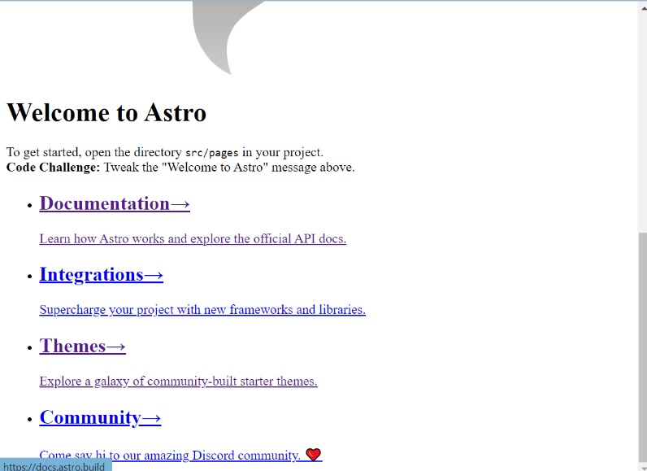
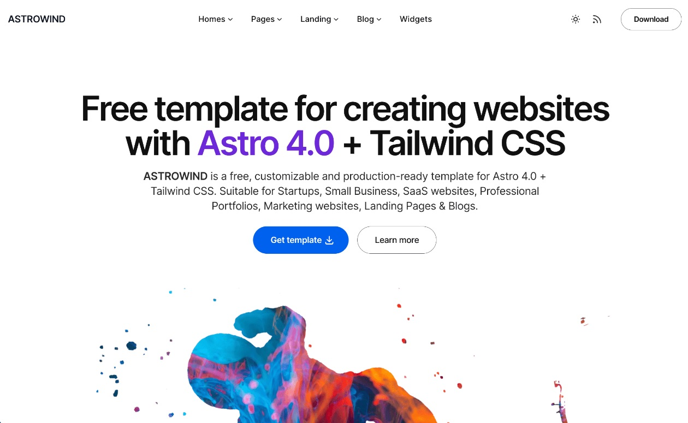
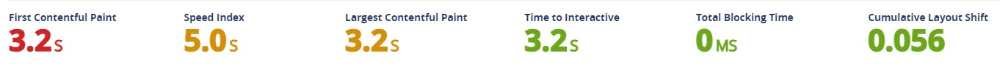
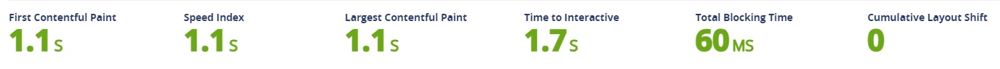

In my last [post](https://bobtabrizi.com/testblogpost), I described my experience of investigating and selecting a new tool to recreate my personal site with. I ended up choosing Astro and briefly explored what one could do with it. 

## Astro Themes
Something I also touched on my previous post was Astro Themes. I quickly gravitated towards a specific one which I'm currently using right now (AstroWind), but I wanted to see what else was out there. To my surprise there was very well thought out and clever website templates people have made for a variety of different purposes. Some templates focused on e-commerce for selling products, some were tailored for the seasoned blog posters, and some like AstroWind were well equipped for personal sites.

Below are some templates that I thought were very interesting and considered trying out:
- [Bento-like Portfolio](https://astro.build/themes/details/grid-portfolio/)
    -  Very unique take on a single web page portfolio. I think the minimalistic design very efficiently directs you with what you need to know from a personal site. Though it does come at a cost with much less detail, leaving potential for more information to be desired. Overall prety cool!
- [Astrofy](https://astro.build/themes/details/astrofy/)
    - Very professional portfolio template. Reads and navigates like a resume on its own! Some thing I did find odd was the inclusion of a store in the template. Perhaps my apprehension stems from my lack of need for one, but I also haven't seen many personal sites with a store either. Nevertheless, the option to slide a store in for a freelancer for example I'd imagine would be pretty handy. 

## Initial Pains
After choosing AstroWind and cloning the template, I immediately began to experiment with the dev site version. To my horror, out of the box something immediately went wrong. The CSS wasn't being applied! I didn't save a screenshot, but the image below is a good representation of what it looked like:

I scoured online for clues on how to get the CSS to properly apply, trying many things but I ultimately couldn't get it working. Out of curiosity I decided to try to see what happenened if I were to push the vanilla template site to be my live website. After I made the change, I found that the CSS was applying in production! Very strange...

After running around in a few circles, I finally came across a thread mentioning that Astro behaved differently across Windows 10 and 11. Now, I'm not going to say I made the upgrade to 11 purely to test out Astro... But lets just say I did it for science. 

Sure enough, after upgrading to Windows 11 everything worked. I'm honestly kind of surprised that Astro was broken right out of the box on Windows 10, but considering the speed at which the shiniest new tech moves these days its understandable that there may be some gaps in testing across operating systems for likely short periods of time. A lesson I've now learned when deploying code of my own for work or my side projects, make sure to check other environments!

## Digging In
Once I was able to start messing around in development mode, I began to pick apart bits and pieces of the AstroWind template. There is a LOT of different prebuilt components and widgets that come with template like AstroWind. I ended up using a select few and created some of my own components to make my site a bit more custom to fit the way I prefer. That isn't to say you can't modify the components they provide, they are definetely workable but some might not fit your specific use case.

While hacking away, I did notice that Astro by default treats component code as TypeScript and the AstroWind template has many many .ts files laying about. While I do have some experience with TS (and aim to become more proficient with it this year) it does add to some of the learning curve to Astro if a developer is not already familiar with it. Not a blocker, but something to keep in mind if you aren't keen on taking the plunge to adopting TS yet from JS. I might cover my journey to becoming more proficient with TypeScript in a later blog post this year... We'll see!

## Responsive Design
After making some basic components and style modifications, I got my site to a stage I would say is presentable. I then started looking into how my site looks in different browser sizes and platforms.For my old website I had to handle this on my own with some initial sizeable effort, but with Astro everything already looks great across the board. Neat! Now lets look at some analytics between my old site and new site with Astro.

## Web Page Analytics
How a site feels to use is a big deal, whether its a business site or a personal site. I ran a lighthouse ([an open-source, automated tool for improving the quality of web pages](https://lighthouse-metrics.com)) on my site before and after using Astro and found some interesting results.

Before:

After:

My website previously was missing a few small accessibility features that Astro templates comes with outside of the box. SEO is not something that I ever really looked into or prioritized since generally my personal site is visited by direct links, but Astro ships with SEO best practices such as allowing search engines permission to crawl web pages and including meta descriptions for pages.

The most interesting enhancement to me, was the performance. When loading Astro sites, there is *very* little javascript content to load. This in turn makes it much faster to visit my site and also navigate around it! If we take a look at the before and after metrics for performance specifically, you can see the impact this difference has.

Before:

After:

The time to interact with the web page was cut almost in half! Compared to my previous site I built using Next.js, I'm pretty impressed with the results. 

To wrap things up, Astro is a pretty neat tool to use for static websites. Just be aware that set up might not always go as planned.

